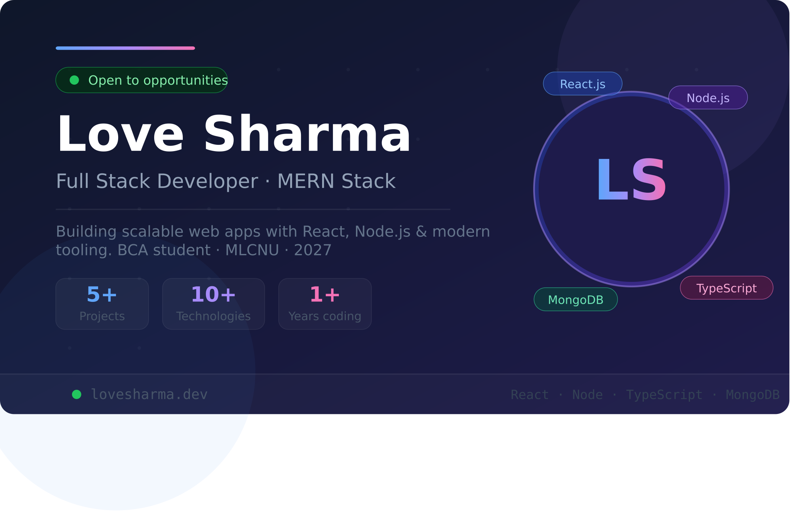

# 🚀 Love Sharma — Developer Portfolio

<div align="center">



[](https://portfolio-lovesharma.vercel.app)
[](https://github.com/loveCoder52)
[](https://linkedin.com/in/love-sharma-dev)

</div>

---

## 📌 About

**Love Sharma** — a Full Stack Developer and BCA student at Makhan Lal Chaturvedi National University (2027). Built to showcase projects, skills, experience, and a working contact form.

---

## ✨ Features

- ⚡ **Fast & Responsive** — works on all screen sizes
- 🎨 **Animated UI** — scroll progress bar, card reveal, typing effect, particle background
- 📬 **Working Contact Form** — powered by EmailJS
- 🌙 **Dark / Light Mode** toggle
- 🔍 **SEO Optimized** — meta tags, Open Graph, JSON-LD structured data
- 📄 **Resume Download** — one-click PDF download
- ♿ **Accessible** — semantic HTML, proper alt tags

---

## 🛠️ Built With

| Technology | Purpose |
|---|---|
| [React.js](https://react.dev) | UI framework |
| [Vite](https://vitejs.dev) | Build tool |
| [Tailwind CSS](https://tailwindcss.com) | Styling |
| [EmailJS](https://www.emailjs.com) | Contact form |
| [Vercel](https://vercel.com) | Deployment |

---

## 📂 Project Structure

```
portfolio/
├── public/
│   ├── photo.jpeg              # Profile photo
│   ├── og-image.png            # Open Graph preview image
│   ├── Love_Sharma_Resume.pdf  # Resume
│   ├── favicon-32.png          # Favicon
│   ├── robots.txt              # SEO
│   └── sitemap.xml             # SEO
├── src/
│   ├── App.jsx                 # Main portfolio component
│   └── main.jsx                # Entry point
├── index.html                  # Meta tags, SEO, JSON-LD
├── vercel.json                 # Vercel SPA routing fix
├── .env                        # Environment variables (not committed)
└── package.json
```

---

## 🚀 Getting Started

### Prerequisites

- Node.js v18+
- npm or yarn

### Installation

```bash
# 1. Clone the repository
git clone https://github.com/lovesharma/portfolio.git

# 2. Navigate into the project
cd portfolio

# 3. Install dependencies
npm install

# 4. Create environment variables
cp .env.example .env
# Fill in your EmailJS credentials in .env

# 5. Start the dev server
npm run dev
```

Open [http://localhost:5173](http://localhost:5173) in your browser.

---

## 🔑 Environment Variables

Create a `.env` file in the root directory:

```env
VITE_EMAILJS_SERVICE_ID=your_service_id
VITE_EMAILJS_TEMPLATE_ID=your_template_id
VITE_EMAILJS_PUBLIC_KEY=your_public_key
```

Get these values from your [EmailJS dashboard](https://dashboard.emailjs.com).

---

## 📦 Scripts

```bash
npm run dev      # Start development server
npm run build    # Build for production
npm run preview  # Preview production build locally
```

---

## 🌐 Deployment

This site is deployed on **Vercel**. Every push to `main` triggers an automatic redeployment.

To deploy your own copy:

1. Fork this repository
2. Import it on [Vercel](https://vercel.com)
3. Add the environment variables in Vercel dashboard
4. Deploy 🎉

---

## 📸 Sections

| Section | Description |
|---|---|
| **Hero** | Name, title, open-to-work badge, social links |
| **About** | Bio, education, goals, stats |
| **Skills** | Frontend, backend, database, tools, programming |
| **Projects** | Authentication App, Blog App with live demos |
| **Experience** | Intern Software Developer, Volunteer Tutor |
| **Contact** | EmailJS-powered contact form + social links |

---

## 📬 Contact

**Love Sharma**

- 📧 Email: [love.sharma@example.com](mailto:love.sharma.engineer@gmail.com)
- 💼 LinkedIn: [linkedin.com/in/lovesharma](https://linkedin.com/in/love-sharma-dev)
- 🐙 GitHub: [github.com/lovesharma](https://github.com/loveCoder52)
- 🌐 Portfolio: [portfolio-lovesharma.vercel.app](https://portfolio-lovesharma.vercel.app)

---

## 📄 License

This project is open source and available under the [MIT License](LICENSE).

---

<div align="center">

Made with ❤️ by [Love Sharma](https://github.com/loveCoder52)

⭐ Star this repo if you found it helpful!

</div>